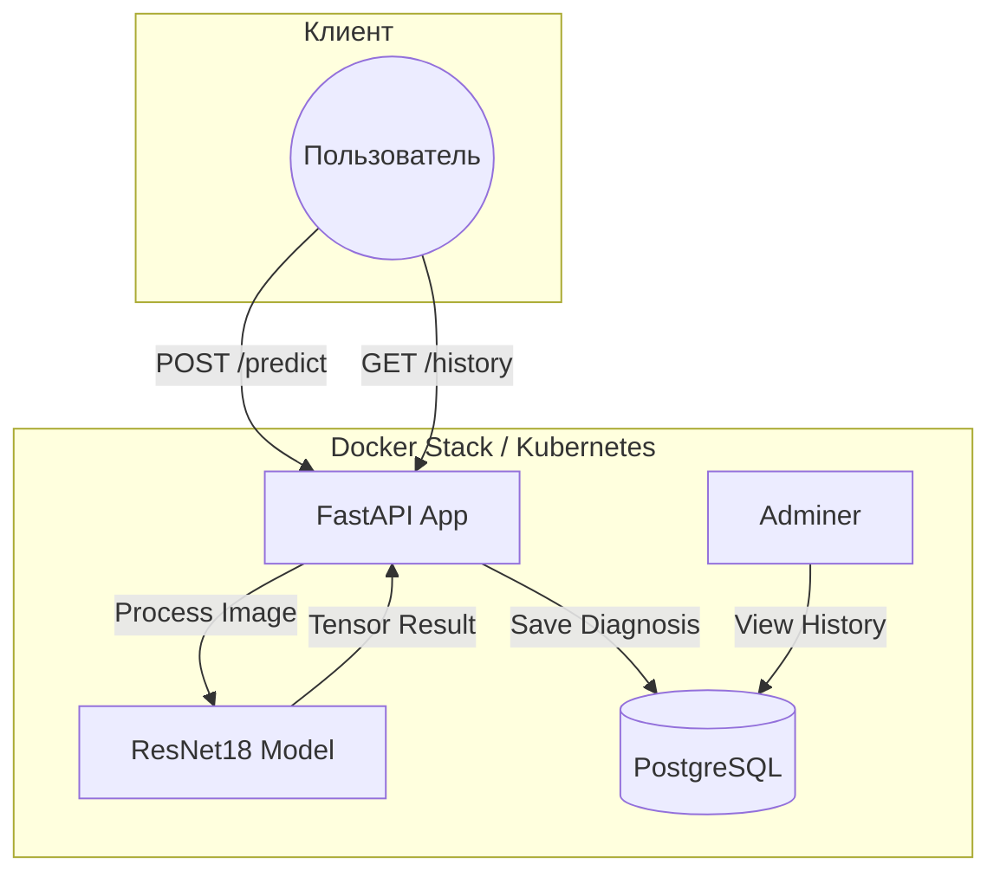

# LungCheck AI: Pneumonia Detection Service

**LungCheck AI** — это полноценный медицинский микросервис для анализа рентгеновских снимков грудной клетки. Проект демонстрирует полный цикл разработки: от обучения нейросети до развертывания в масштабируемой инфраструктуре.

### 🚀 Основные возможности

- Deep Learning Core: В основе лежит архитектура ResNet18 с использованием Transfer Learning.
- Высокая уверенность: Модель выдает предсказания с точностью >99% на валидационной выборке.
- Промышленный стек: Асинхронный FastAPI, PostgreSQL для хранения истории, миграции Alembic.
- Infrastructure as Code: Полная контейнеризация через Docker и готовые манифесты для Kubernetes.
- Tracking: Сохранение каждого результата диагностики в базу данных.


## Демонстрация работы на примере `(http://127.0.0.1:8000/api/v1/lungcheck/history`
Использванны демонстрационные рентгенологические снимки


## Архитектура системы



### 🧠 Обучение и ограничения модели (Disclaimer)
- Данная модель разработана как Proof of Concept (PoC) для демонстрации работы ML-пайплайна.
- Данные: Модель обучена на выборке из 390 профильных снимков высокого качества (Chest X-Ray).
- Специфика: Нейросеть оптимизирована строго под рентгенографические снимки грудной клетки в прямой проекции.
- Ограничения: Из-за специфики обучающей выборки (Data Distribution), при подаче случайных картинок из интернета или снимков другого типа, модель может выдавать ложные результаты. Для корректной работы требуются стандартные медицинские рентген-снимки.


### 🛠 Технологический стек
- Backend: Python 3.12, FastAPI, SQLAlchemy 2.0 (Async), Pydantic.
- ML: PyTorch, Torchvision, Pillow.
- DevOps: Docker, Docker Compose, Kubernetes (Deployment, Service, ConfigMap).
- Database: PostgreSQL, Alembic.

## 📦 Быстрый запуск
### 1. Клонируйте репозиторий:

```python
    git clone https://github.com
    cd LungCheck
```

### 2. Запустите проект одной командой:

```python
    docker compose up --build
```

### 3. Документация API:
После запуска Swagger доступен по адресу: `http://localhost:8000/docs` (Swagger UI)

## ☸️Kubernetes
- В папке `/k8s` подготовлены манифесты для деплоя системы в кластер:
- Поддержка горизонтального масштабирования (2 реплики приложения).
- Разделение конфигурации через ConfigMap.
- Сервисы для доступа к БД и API.

## Автор
### Максим Губенин

- **Telegram:** @SKDM25: https://t.me/SKDM25
- **Email:** maksimgubenin@mail.ru
- **GitHub:** Maksim-Gubenin
